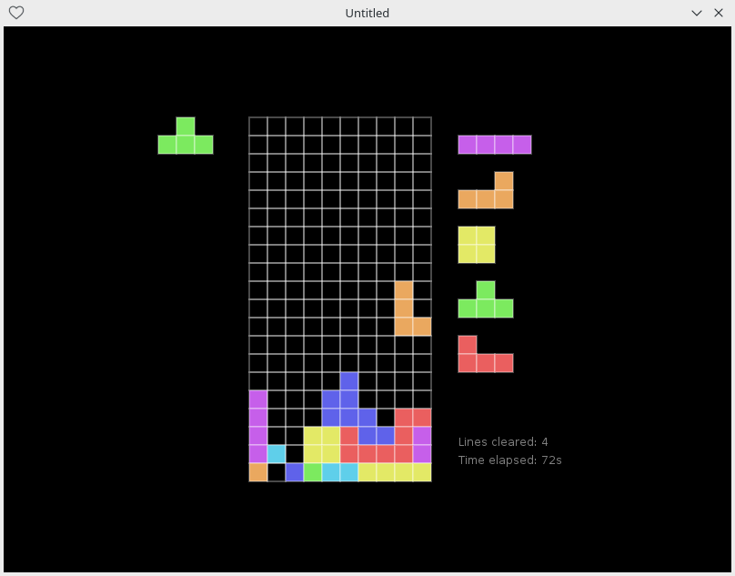

# tetris-love-ecs

This is a Tetris clone built with an ECS architecture in mind. It provides mostly classic Tetris gameplay, with the added features of:

* Hold a piece
* Random bag for the pieces
* Ability to see 5 pieces ahead.

Developed in lua using the [love2d](https://love2d.org) framework. 

The ECS library is [Concord](https://github.com/Tjakka5/Concord/).

This was done to experiment with ECS and love2d. The keys are not configurable at the moment, and are as follows:
* Move left: **Left arrow**
* Move right: **Right arrow**
* Move down: **Down arrow**
* Rotate clockwise: **Up arrow**
* Rotate counter-clockwise: **Z**
* Place piece instantly: **Space**
* Hold piece: **C**
* Pause the game: **P**
* Restart the game: **R**

